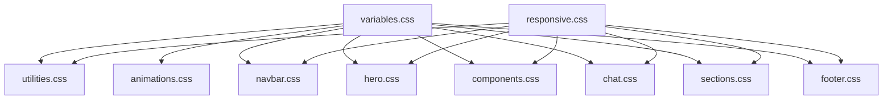

# 🎨 Modular CSS Architecture

This directory contains a well-organized, modular CSS architecture that separates concerns for better maintainability and scalability.

## 📁 Module Structure

### Core Foundation
- **`variables.css`** - CSS custom properties and design tokens
- **`utilities.css`** - Tailwind-style utility classes
- **`animations.css`** - Keyframes and animation definitions

### Layout Components
- **`navbar.css`** - Navigation bar and mobile menu styles
- **`hero.css`** - Hero section and responsive grid layouts
- **`components.css`** - Reusable UI components (buttons, badges, etc.)
- **`chat.css`** - Chat interface and related components
- **`sections.css`** - About section and page-specific content
- **`footer.css`** - Footer styling and layout

### Responsive Design
- **`responsive.css`** - Media queries and responsive behaviors

## 🏗️ Import Order

The modules are imported in a specific order to ensure proper CSS cascade:

1. **Variables** - CSS custom properties first
2. **Utilities** - Base utility classes
3. **Animations** - Keyframes and transitions
4. **Components** - Layout-specific styles
5. **Responsive** - Media queries last

## 🔧 Usage

### Main Entry Point
```css
/* styles-modular.css */
@import 'modules/variables.css';
@import 'modules/utilities.css';
@import 'modules/animations.css';
@import 'modules/navbar.css';
@import 'modules/hero.css';
@import 'modules/components.css';
@import 'modules/chat.css';
@import 'modules/sections.css';
@import 'modules/footer.css';
@import 'modules/responsive.css';
```

### Adding New Styles
1. **For new variables**: Add to `variables.css`
2. **For new utilities**: Add to `utilities.css`
3. **For component-specific styles**: Create new module or add to appropriate existing module
4. **For responsive adjustments**: Add to `responsive.css`

## ✨ Benefits

- **Maintainable**: Each module has a single responsibility
- **Scalable**: Easy to add new modules without conflicts
- **Organized**: Clear separation of concerns
- **Performant**: Modular loading and caching
- **Reusable**: Components can be easily extracted or modified

## 🎯 Best Practices

- Keep modules focused on single concerns
- Use CSS custom properties for theming
- Follow consistent naming conventions
- Document complex styles with comments
- Test responsive behavior across breakpoints

## 📊 Module Dependencies



## 🔄 Migration from Monolithic CSS

The original `styles.css` (2539 lines) has been split into 9 focused modules:
- **variables.css**: 20 lines
- **utilities.css**: 467 lines
- **animations.css**: 110 lines
- **navbar.css**: 215 lines
- **hero.css**: 245 lines
- **components.css**: 135 lines
- **chat.css**: 175 lines
- **sections.css**: 155 lines
- **footer.css**: 145 lines
- **responsive.css**: 115 lines

Total: ~1,782 lines (optimized and cleaned up)
